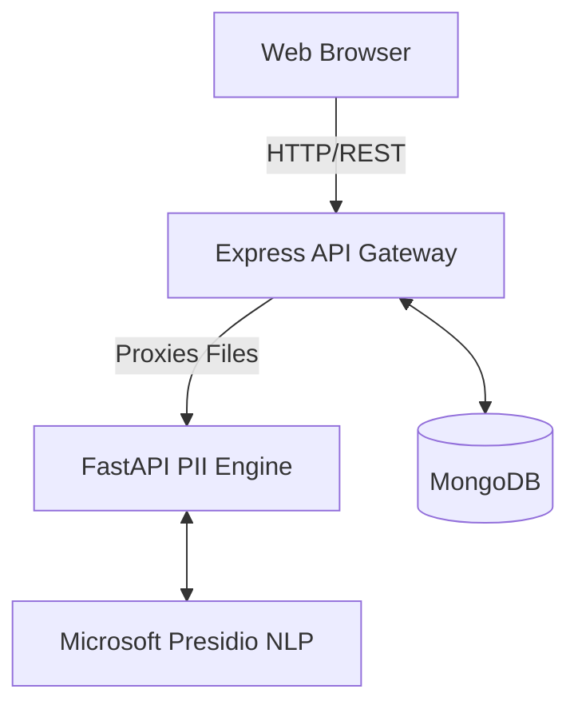
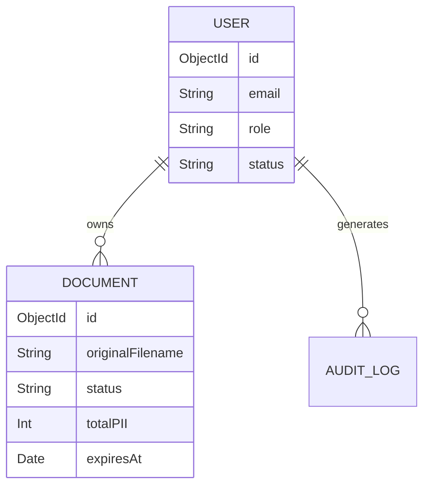

# Architecture Documentation

## High-Level System Architecture

The PII Redaction Tool follows a modern microservices-inspired architecture with strict separation of concerns between the frontend presentation, backend orchestration, and the ML/NLP processing engine.

### 1. Frontend (React / Vite)
- **Role**: Presentation and User Interaction.
- **Frameworks**: React, Tailwind CSS, shadcn/ui.
- **State**: React hooks, Context API (for auth).
- **Communication**: Axios client with interceptors for JWT token attachment.

### 2. Backend (Node.js / Express)
- **Role**: Application Logic, Authentication, Database interactions, and Orchestration.
- **Pattern**: Model-View-Controller (MVC)
  - `Routes`: Map HTTP methods to controllers.
  - `Middleware`: Authentication (`auth.middleware.ts`) and File Parsing (`upload.middleware.ts`).
  - `Controllers`: Business logic and orchestration.
  - `Models`: Mongoose schemas.
- **Storage**: Temporary storage in `uploads/` for processing. Redacted files are saved to `generated/`.

### 3. PII Engine (Python / FastAPI)
- **Role**: Heavy lifting NLP tasks, document text extraction, PII detection, and redaction.
- **Dependencies**: 
  - `presidio-analyzer` & `presidio-anonymizer`
  - `spacy` (`en_core_web_lg` model)
  - `python-docx` and `PyMuPDF` for document parsing.
- **Logic**: Custom `ConsistentFakerOperator` ensures deterministic replacement mappings across a single document payload.

## Database Design

## Security Architecture
- **JWT**: Stateless token-based authentication.
- **Bcrypt**: Password hashing with a factor of 10.
- **Role-Based Access Control (RBAC)**: Admin routes are protected by a specific `adminProtect` middleware.
- **Data Lifecycle**: Anonymous uploads have an `expiresAt` TTL which allows a cron job or MongoDB TTL index to auto-delete them.
